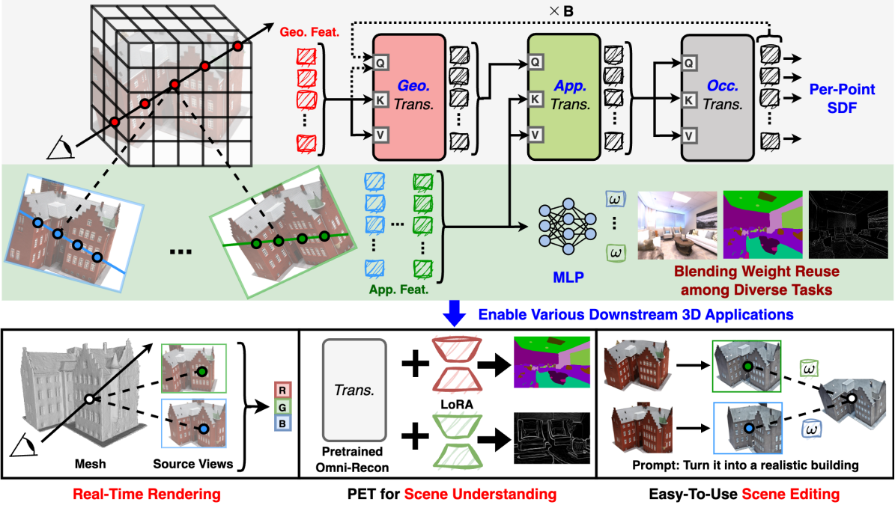
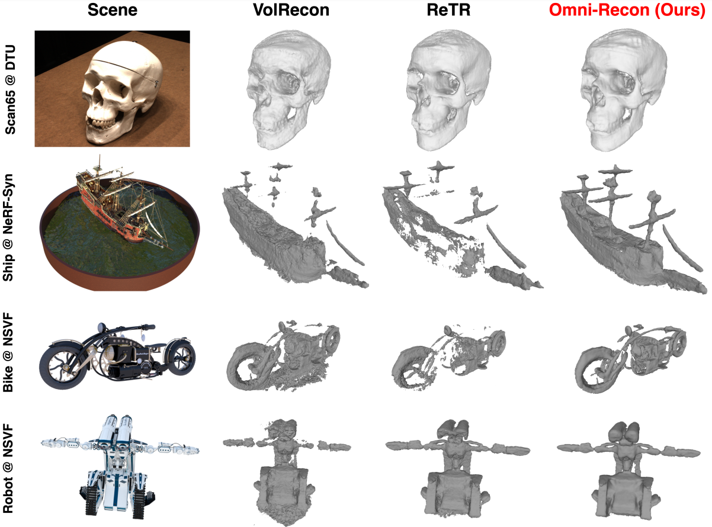
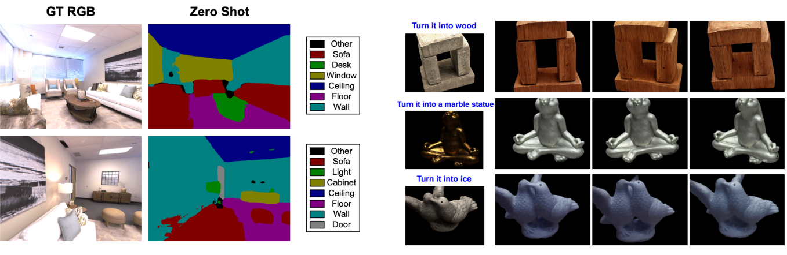

# Omni-Recon: Harnessing Image-based Rendering for General-Purpose Neural Radiance Fields
Yonggan Fu, Huaizhi Qu, Zhifan Ye, Chaojian Li, Kevin Zhao, and Yingyan (Celine) Lin

Accepted at ECCV 2024 as ***an Oral Paper*** [[Paper](https://arxiv.org/pdf/2403.11131) | [Slide](https://drive.google.com/file/d/1oK4OHuoE-Lq-mt3DLFIDbmtUJfncinVo/view?usp=sharing)].


## Omni-Recon: Overview
- **Motivation and insight:** Drawing inspiration from the generalization capability and adaptability of emerging foundation models, our work aims to develop one general-purpose NeRF for handling diverse 3D tasks. We achieve this by proposing a framework called Omni-Recon, which is capable of (1) generalizable 3D reconstruction and zero-shot multitask scene understanding, and (2) adaptability to diverse downstream 3D applications such as real-time rendering and scene editing. Our key insight is that an image-based rendering pipeline, with accurate geometry and appearance estimation, can lift 2D image features into their 3D counterparts, thus extending widely explored 2D tasks to the 3D world in a generalizable manner.

<p align="center">
  
</p>

- **Implementation:** Omni-Recon features an image-based rendering model with two decoupled branches: one complex transformer-based branch that progressively fuses geometry and appearance features for accurate geometry estimation, and one lightweight branch for predicting blending weights of source views. This design achieves SOTA generalizable 3D surface reconstruction quality with blending weights reusable across diverse tasks for zero-shot multitask scene understanding. In addition, it can rapidly enable real-time rendering after baking the complex geometry branch into meshes and seamless integration with 2D diffusion models for text-guided 3D editing.

- **Results:** We visualize Omni-Recon's achieved results for surface reconstruction, zero-shot scene understanding, and scene editing as follows.

<p align="center">
  
</p>


<p align="center">
  
</p>


## Code Usage


### Environment Setup

We provide a docker to setup the environment:

```
docker pull ghcr.io/gatech-eic/omni-recon/omni_recon:latest
docker run --gpus all -v /home/$USER:/home/$USER -it ghcr.io/gatech-eic/omni-recon/omni_recon:latest bash
```

- In addition, we have also included all the python packages in `requirements.txt`:

```
pip install -r requirements.txt
``` 


### Dataset preparation

- Download pre-processed [DTU dataset](https://drive.google.com/file/d/1cMGgIAWQKpNyu20ntPAjq3ZWtJ-HXyb4/view?usp=sharing).
  
- For quantitative evaluation, download [SampleSet](http://roboimagedata.compute.dtu.dk/?page_id=36) and [Points](http://roboimagedata.compute.dtu.dk/?page_id=36) from DTU's website and put the unzipped `Points` folder in `SampleSet/MVS Data/`.


### Generalizable surface recontruction

- Update `DTU_PATH` in `script/eval_mesh.sh` to the path of the downloaded DTU dataset and run the following command to reconstruct all surfaces of DTU test scenes:

```
bash script/eval_mesh_all.sh
```


### Mesh finetuning using Nvdiffrast

- Update `DTU_PATH` in `script/mesh_ft.sh` to the path of the downloaded DTU dataset.
   
- Extract the initial scene mesh and then finetune the mesh and the shader with Nvdiffrast:

```
bash script/mesh_ft.sh
```

### Train the Omni-Recon model from scratch

- Update `DTU_PATH` in `script/train_dtu.sh` to the path of the downloaded DTU dataset.
   
- Run the following command to launch the training:

```
bash script/train_dtu.sh
```


## Acknowledgment

We refer to the implementations in [VolRecon](https://github.com/IVRL/VolRecon), [ReTR](https://github.com/YixunLiang/ReTR), [NeuRay](https://github.com/liuyuan-pal/NeuRay), and [GNT](https://github.com/VITA-Group/GNT).


## Citation

```
@inproceedings{fu2025omni,
  title={Omni-Recon: Harnessing Image-Based Rendering for General-Purpose Neural Radiance Fields},
  author={Fu, Yonggan and Qu, Huaizhi and Ye, Zhifan and Li, Chaojian and Zhao, Kevin and Lin, Yingyan},
  booktitle={European Conference on Computer Vision},
  pages={153--174},
  year={2025},
  organization={Springer}
}
```
